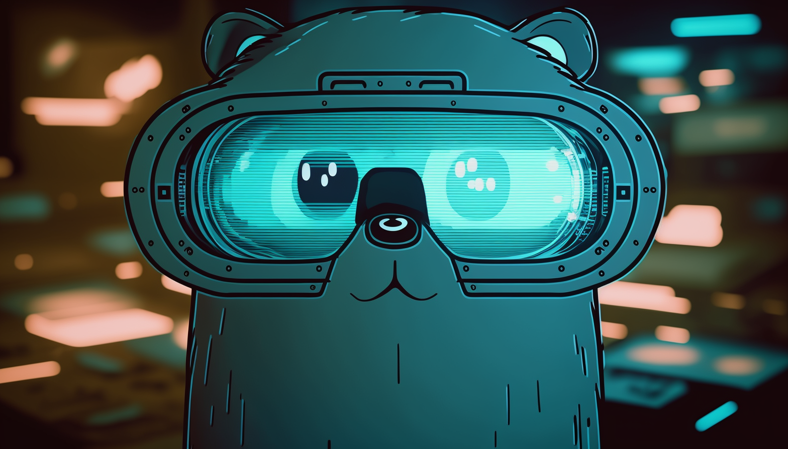

<p align="center">
  
</p>

> Wallpaper by: Mayderson Mello

# Golang - Realtime Object Detection

## Overview

This project is written in Golang to perform real-time object detection on security cameras, webcams or video files.

Tensorflow was used with a pre-trained model called COCO SSD, to perform the detections in the captured video frame, and with the use of OpenCV it was possible to draw a rectangle in the area where the object was located, and also write a text with the name of the detected object.

- [x] Tensorflow
- [x] OpenCV
- [x] Model COCO SSD
- [x] Concurrency using Goroutines
- [x] Workers
- [x] Docker + Docker Compose

---

## Environment

The entire environment of this application is running on Docker, but there are some important points to be raised, the window that opens via Docker showing the detection preview can only be viewed if you use Linux.

The **"DISPLAY"** environment variable present in [docker-compose.yaml](./docker-compose.yaml), is used to inform the Linux operating system about the X display server (X11) being used to display graphical applications. Since other operating systems do not use the X11 display server, this environment variable is not applicable for them.

Volume **"/tmp/.X11-unix"** is used to mount the X11 display server socket in the Docker container, allowing graphical applications to be displayed on the host screen.

Therefore, if you don't use Linux and want to have the window showing the detection preview, I recommend not using Docker in this case, and installing the Tensorflow and OpenCV dependencies that are necessary in the project on your main system, you can use [docker-compose.yaml](./docker-compose.yaml) as the basis for installing these dependencies.

---

## Setup app

### Define cameras

Change the `getCameras` function in the [main.go](./cmd/main.go) file, adding the cameras you want to run object detection. The `Input` attribute must be specified an **RTSP** url of the security camera or the **Device ID** of your Webcam or even a **local video file**.

```go
// List of cameras to run object detection
func getCameras() (cameras []entity.VideoStream) {
	cameras = []entity.VideoStream{
		{
			ID:    "1",
			Label: "Camera 1",
			Input: "rtsp://host:port",
		},
	}

	return cameras
}
```

### Handle detection preview

If you do not use Linux on your host system, or you have not chosen to install Tensorflow and OpenCV dependencies on your system without using Docker, you should comment out or remove the lines below in the [opencv.go](./internal/infra/opencv/opencv.go) as they are responsible for opening a window with the detection preview:

```diff
// Start capturing video frames by Device ID, video file, RTSP/URL, or GStreamer pipeline
func (oip *OpenCVImageProcessor) CaptureStreamVideo(input interface{}, runDetectionCallback func(currentFrame gocv.Mat)) error {
	videoStream, err := gocv.OpenVideoCapture(input)
	if err != nil {
		return fmt.Errorf("unable to open video capture: %v", err)
	}

	frame := gocv.NewMat()

-	window := gocv.NewWindow("Golang Object Detection")

	if ok := videoStream.Read(&frame); !ok {
		return fmt.Errorf("unable to capture image from camera")
	}

	for {
		videoStream.Read(&frame)

		if frame.Empty() {
			continue
		}

		runDetectionCallback(frame)

-		window.IMShow(frame)
-		window.WaitKey(1)
	}
}
```

### Handle Webcam device

If you don't have Webcam built-in or connected to your system, you should comment out or remove the lines below in the [docker-compose.yaml](./docker-compose.yaml) file:

```diff
version: '3'

services:
  goapp:
    container_name: "go_object_detection"
    build:
      context: .
    environment:
      - DISPLAY=${DISPLAY}
-    devices:
-      - "/dev/video0:/dev/video0"
    volumes:
      - ".:/go/app"
      - "/tmp/.X11-unix:/tmp/.X11-unix"
    network_mode: host
```

If you don't use Linux on your host system, you should comment out or remove the lines below in the [docker-compose.yaml](./docker-compose.yaml) file:

```diff
version: '3'

services:
  goapp:
    container_name: "go_object_detection"
    build:
      context: .
-    environment:
-      - DISPLAY=${DISPLAY}
    devices:
      - "/dev/video0:/dev/video0"
    volumes:
      - ".:/go/app"
-      - "/tmp/.X11-unix:/tmp/.X11-unix"
-    network_mode: host
```

## Run app

Start container:

> This process may take a few minutes, as it will be necessary to compile some dependencies in C++

```sh
$ docker-compose up -d
```

Access application container:

```sh
$ docker exec -it go_object_detection /bin/bash
```

Install dependencies:

```sh
$ go mod tidy
```

Configure sharing the detection preview window with your host system, this step is only necessary if you use Linux on the host system and are running the application through a container.

Run on host system:

```sh
# Copy entire line
$ xauth list
```

Run in container:

```sh
# Run this command
$ xauth
# Type "add" and then paste that line you copied when running "xauth list", and then press "Control + D" to save
$ add entire-line-copied-from-system-host
```

Run app:

```sh
$ go run cmd/main.go
```
